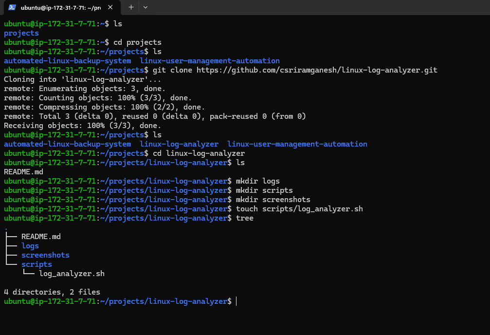
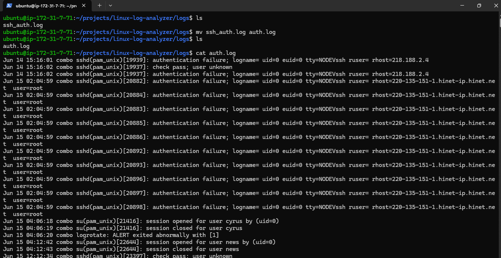
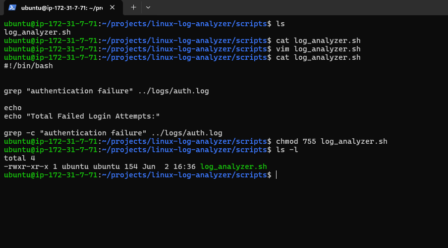
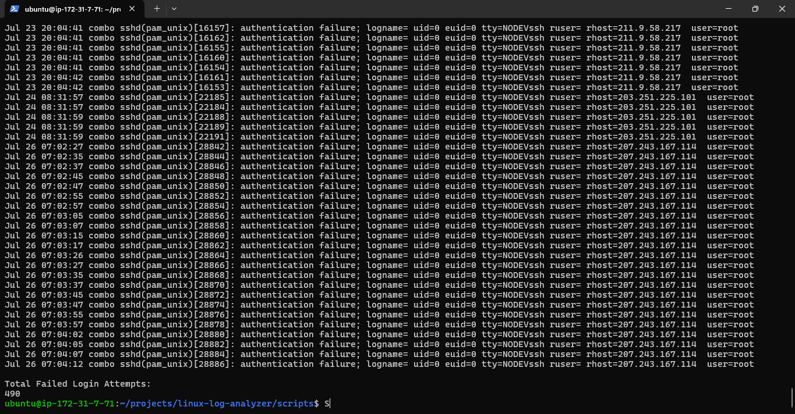
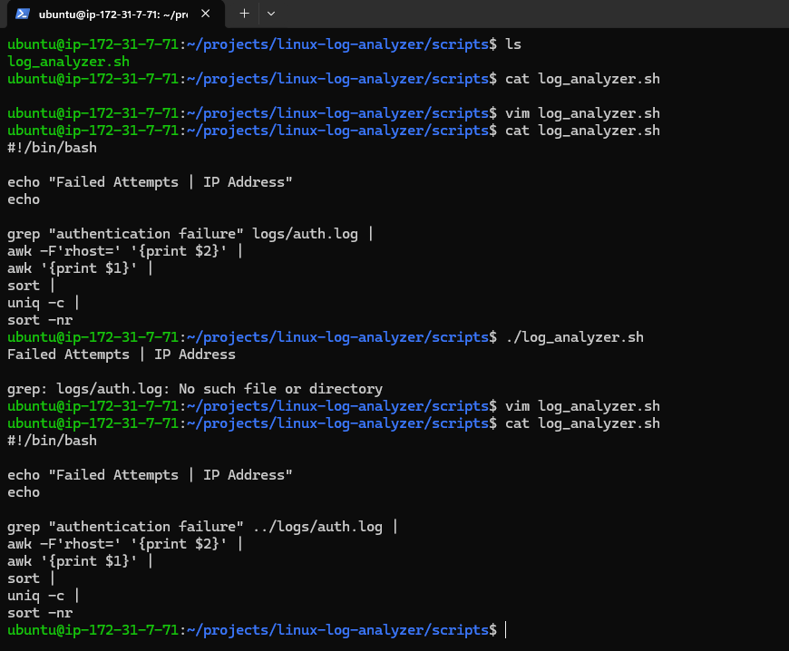
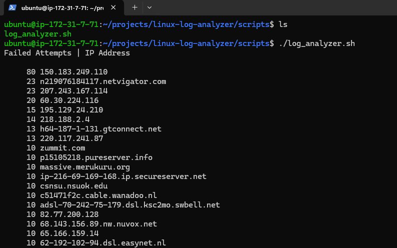
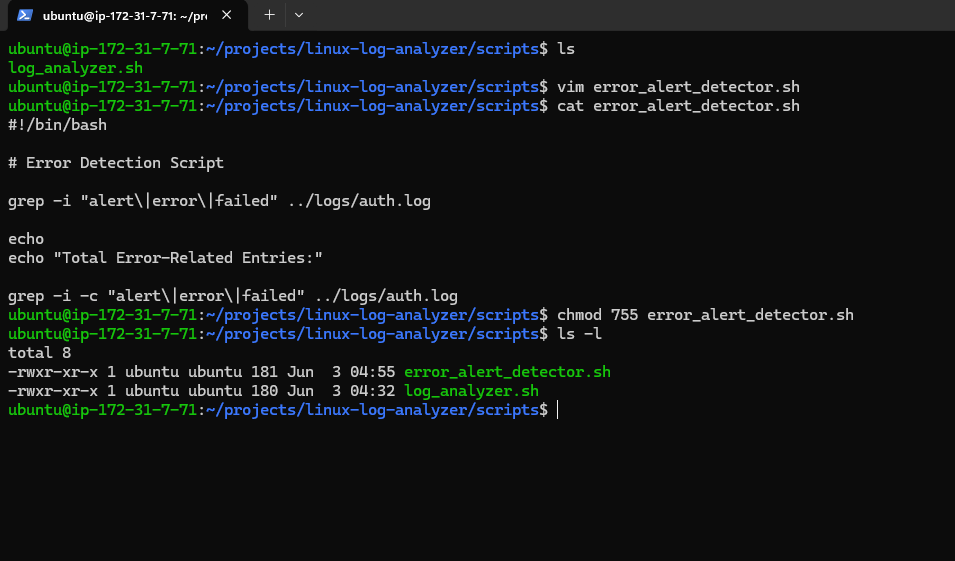
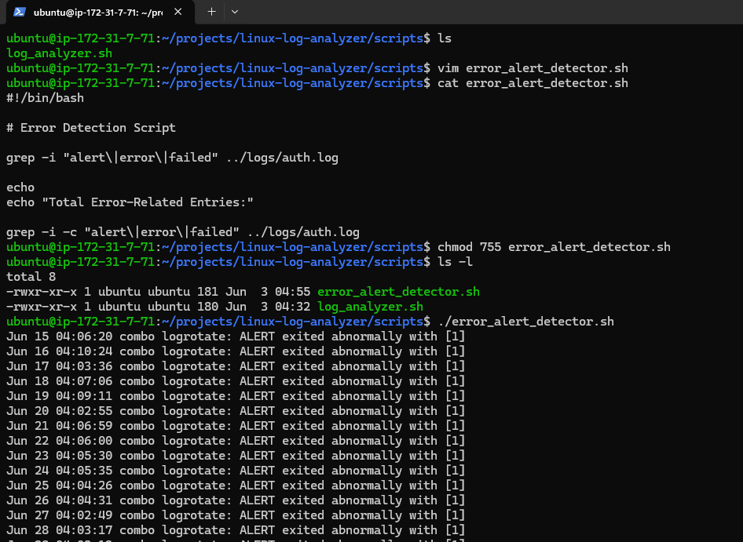
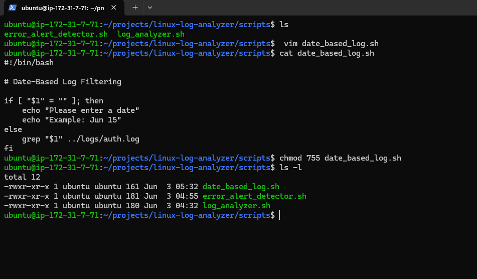
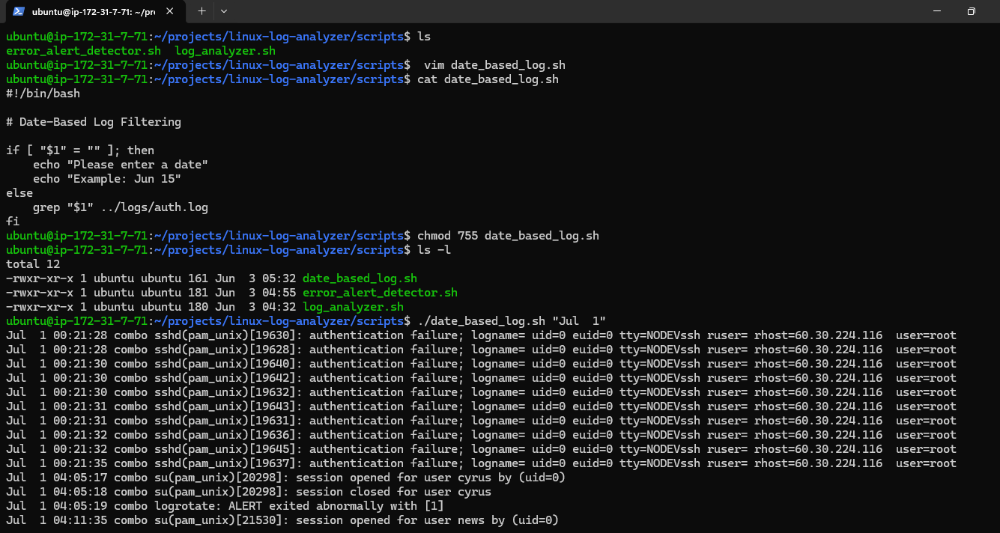

# Linux Log Analyzer

A Bash-based Linux Log Analysis project that helps identify authentication failures, suspicious activity, and troubleshooting information from Linux log files.

## Project Overview

This project demonstrates practical Linux log analysis techniques using common command-line tools such as:

* grep
* awk
* sort
* uniq
* Bash scripting

The project uses real authentication logs and performs security-focused analysis that is commonly used by Linux administrators, DevOps engineers, and security teams.

---

## Features Implemented

### 1. Failed Login Detection

Detects authentication failures from the log file and displays all failed login attempts.

Example:

```bash
./scripts/log_analyzer.sh
```

Displays:

* Failed authentication entries
* Total failed login count

---

### 2. Top Attacking IP Detection

Extracts IP addresses from failed login attempts and ranks them based on frequency.

Displays:

* IP addresses responsible for failed logins
* Number of attempts per IP
* Most active attacking IPs first

---

### 3. Error Detection and Counting

Searches the log file for error-related entries.

Keywords analyzed:

* error
* failed
* alert

Displays:

* Matching log entries
* Total number of error-related events

---

### 4. Date-Based Log Filtering

Allows filtering log entries by a specific date.

Example:

```bash
./date_based_log.sh "Jul 15"
```

Displays only log entries from the specified date.

---

## Technologies Used

* Linux
* Bash Scripting
* grep
* awk
* sort
* uniq
* Git
* GitHub

---

## Project Structure

```text
linux-log-analyzer/
│
├── README.md
│
├── logs/
│   └── auth.log
│
├── screenshots/
│
└── scripts/
    ├── date_based_log.sh
    ├── error_alert_detector.sh
    └── log_analyzer.sh
```

---

## Screenshots

### Project Structure



### Authentication Log Added



### Failed Login Detection Script



### Failed Login Detection Output



### Top Attacking IP Detection Code



### Top Attacking IP Detection Output



### Error Detection Code



### Error Detection Output



### Date Filter Code



### Date Filter Output



---

## Example Usage

Make the script executable:

```bash
chmod 755 scripts/log_analyzer.sh
```

Run the analyzer:

```bash
./log_analyzer.sh
```

Filter logs by date:

```bash
./date_based_log.sh "Jun 15"
```

---

## Skills Demonstrated

* Linux Administration
* Log Analysis
* Security Monitoring
* Bash Scripting
* Text Processing
* Troubleshooting
* Git Version Control
* GitHub Project Documentation

---

## Future Enhancements

* Suspicious IP Detection
* Security Alert Generation
* Automated Reporting
* Log Summary Dashboard
* CSV Report Export
* Email Alert Notifications

---

## Author

Built as part of a DevOps and Linux Administration portfolio project.
